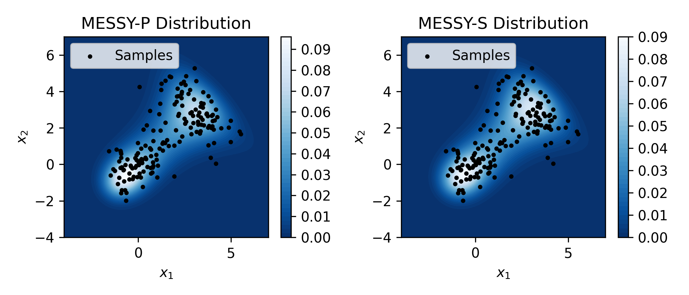

[](https://doi.org/10.48550/arXiv.2306.04120)


# Maximum-Entropy based Stochastic and Symbolic density estimation (MESSY)

In this repository, we present an implementation of the MESSY paper published in Transactions on Machine Learning Research:

https://openreview.net/pdf?id=Y2ru0LuQeS



# Usage
To use the code, first, import the content of the ```messy.py``` via


```from messy import *```


Then, instantiate the class ```MESSY``` by initializing its member variables, e.g.


```
highest_order = 4
x = sp.symbols('x', real=True)
pow = [sp.lambdify(x, x**i, "numpy") for i in range(1, highest_order+1)] # Poly. basis functions
binary_operators = [sp.Mul]
unary_functions = [sp.cos, sp.sin] + pow

messy = MESSY(n_levels=1, nm_xe=2, highest_order=highest_order, nb_l=2, nb_u=4, poly_order=4, tree_depth=2, binary_operators=binary_operators, unary_functions=unary_functions)
```
Then, find the fit by calling
```
dic, best_iter = messy.get_pdf(X, N_iters=10)
```

In return, ```dic``` contains a list of fitted PDFs, and ```best_iter``` is the index of the best-fitted pdf. You can check the MESSY-P and MESSY-S fits via
```
print("Found MESSY-P:")
print( dic[0][1] )

print("Found MESSY-S:")
print( dic[best_iter][1] )
```
For more details on how MESSY can be used, see notebooks in the directory ```examples/```
